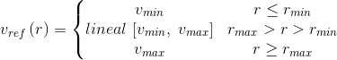
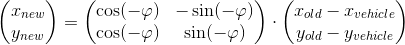

# CarND-Controls-MPC
Self-Driving Car Engineer Nanodegree Program

---
## Basic Build Instructions

1. Clone this repo.
2. Go to the build directory: `cd build`
3. Compile: `cmake .. && make`
4. Run it: `./mpc params_racing.json` or `./mpc params_comfort.json`

## Model Description

The implementation of the MPC (Model Predictive Control) in the car simulator is using the following Kinematic model, which does not account for tire lateral and longitudinal forces:

x<sub>​t+1</sub> = x<sub>t</sub> + v<sub>t</sub> cos(ψ<sub>t</sub>) Δt

y<sub>​t+1</sub> = y<sub>t</sub> + v<sub>t</sub> sin(ψ<sub>t</sub>) Δt

ψ<sub>​t+1</sub> = ψ<sub>t</sub> + v<sub>t</sub> δ<sub>t</sub> Δt / L<sub>f</sub>

v<sub>​t+1</sub> = v<sub>t</sub> + α<sub>t</sub> Δt

state = {x, y, ψ, v}

actuators = {δ, α}

In order to measure how well the car is driving within the planned trajectory, we add to the state the following two new variables:

cte = cross-track error

eψ = ψ angle error

cte<sub>​t+1</sub> = cte<sub>t</sub> + v<sub>t</sub> sin(eψ<sub>t</sub>) Δt

eψ<sub>​t+1</sub> = eψ<sub>t</sub> + v<sub>t</sub> δ<sub>t</sub> Δt / L<sub>f</sub>

state = {x, y, ψ, v, cte, eψ}

actuators = {δ, α}

The MPC drives a vehicle on a predefined trajectory by solving an optimization problem of predicted states over a time period. This optimization problem finds the actuator values that minimize a given cost function f given some variable constraints expressed in several g functions.

**f(cte, eψ, v, δ, α)** = w<sub>cte</sub> cte<sup>2</sup> + w<sub>eψ</sub> eψ<sup>2</sup> + w<sub>v</sub> (v-v<sub>ref</sub>)<sup>2</sup> + w<sub>δ</sub> v δ<sup>2</sup> + w<sub>α</sub> α<sup>2</sup> + w<sub>Δδ</sub> Δδ<sup>2</sup> + w<sub>Δα</sub> Δα<sup>2</sup> + w<sub>Δcte</sub> Δcte<sup>2</sup>

0 ≤ **g<sub>1</sub>(state, actuators)** = x<sub>​t+1</sub> - x<sub>t</sub> + v<sub>t</sub> cos(ψ<sub>t</sub>) Δt ≤ 0

0 ≤ **g<sub>2</sub>(state, actuators)** = y<sub>​t+1</sub> - y<sub>t</sub> + v<sub>t</sub> sin(ψ<sub>t</sub>) Δt ≤ 0

0 ≤ **g<sub>3</sub>(state, actuators)** = ψ<sub>​t+1</sub> - ψ<sub>t</sub> + v<sub>t</sub> δ<sub>t</sub> Δt / L<sub>f</sub> ≤ 0

0 ≤ **g<sub>4</sub>(state, actuators)** = v<sub>​t+1</sub> - v<sub>t</sub> + α<sub>t</sub> Δt ≤ 0

0 ≤ **g<sub>5</sub>(state, actuators)** = cte<sub>​t+1</sub> - cte<sub>t</sub> + v<sub>t</sub> sin(eψ<sub>t</sub>) Δt ≤ 0

0 ≤ **g<sub>6</sub>(state, actuators)** = eψ<sub>​t+1</sub> - eψ<sub>t</sub> + v<sub>t</sub> δ<sub>t</sub> Δt / L<sub>f</sub> ≤ 0

-25<sup>o</sup> ≤ **g<sub>7</sub>(state, actuators)** = δ ≤ 25<sup>o</sup>

-1.0 ≤ **g<sub>8</sub>(state, actuators)** = α ≤ 1.0

## Hyperparameters
The MPC optimization algorithm performs N predictions of the state and actuator vectors after Δt has elapsed. N and Δt are two very important parameters to tune the algorithm.

If N is large, we will be more accurate in our predictions at the cost of more computation power. On the contrary, if N is very small we will save a lot of computing resources at the cost of less accuracy in the predicted trajectory due to having less steps. This lack of accuracy in the trajectory becomes critical if we want to carve the perfect line on high turns at racing speeds.
If Δt is large we will lose resolution in our predictions, leading to errors in our optimized values as the kinematic model assumes no change in the state during the Δt period. On the contrary if Δt is too small, we will be predicting very similar state values which may be a waste of cpu power for the same output values.

The ideal is to predict 1.5-2 seconds ahead of the current state.
N=20
Δt=0.1

Another important parameter in our model is the reference velocity used at the cost function. In order to achieve the maximum velocity while ensuring a safe turning at curves, we use a function to determine the reference velocity based on the radio of the curve ahead:



Which bring the following new parameters to our model, tuned-up for the racing configurations:

| v<sub>max</sub> = 120mph | v<sub>min</sub> = 80mph | r<sub>max</sub> = 65m | r<sub>min</sub> = 35m |

And for the comfort configuration:

| v<sub>max</sub> = 100mph | v<sub>min</sub> = 55mph | r<sub>max</sub> = 65m | r<sub>min</sub> = 35m |

And last but not least, we have the weights of the cost function as parameters of the model. They indicate to the optimization algorithm which variables are more important to keep low while finding the solution.

These are the final values for the racing configuration:

| w<sub>cte</sub> = 2 | w<sub>eψ</sub> = 12 | w<sub>v</sub> = 1 | w<sub>δ</sub> = 1450 | w<sub>α</sub> = 1 | w<sub>Δcte</sub> = 1 | w<sub>Δδ</sub> = 10 | w<sub>Δα</sub> = 1 |

And these are the final values for the comfort configuration:

| w<sub>cte</sub> = 3 | w<sub>eψ</sub> = 15 | w<sub>v</sub> = 1 | w<sub>δ</sub> = 1000 | w<sub>α</sub> = 1 | w<sub>Δcte</sub> = 1 | w<sub>Δδ</sub> = 20 | w<sub>Δα</sub> = 1 |

Please note from the cost function that w<sub>δ</sub> is multiplied by the current velocity to ensure the steering angle decreases as the vehicle speeds up.

## Polynomial Fit
The input to the MPC is a set of points that form the trajectory that the vehicle must follow. As the optimization problem is independent of the frame of reference, we translate the points into the vehicle's coordinates for convenience. In the vehicle coordinates, the x axis is pointing in the direction of the vehicle's heading and the y axis is pointing to the left of the vehicle. That implies offsetting the points to where the vehicle is positioned and rotating them by -ψ angle.



In the vehicle's frame of reference, the car is located at the point 0,0 and is heading with an angle of 0 degrees.

## Latency

In order to apply a particular latency to the model, we follow these steps:
1. Since we will not be able to change the actuators during the latency period (100ms) and the simulator will continue moving the vehicle, we use the kinematic model and the current throttle and steering angle values to find out a new state {x, y, ψ, v}
2. We proceed with the MPC problem as if there was no latency using the new state obtained in step 1.
3. We measure the time it takes to make all the MPC computations, and we subtract that time from the latency period (100ms) in order to emulate latency as much accurate as possible.

This approach seems to work well when dealing with latency and drawing the desired and predicted trajectories in the screen.

## Videos
Racing Configuration:

[](https://youtu.be/lSQzZZIc528)

Comfort Configuration:

[](https://youtu.be/yYkk5Fkhvnw)


## Dependencies

* cmake >= 3.5
 * All OSes: [click here for installation instructions](https://cmake.org/install/)
* make >= 4.1
  * Linux: make is installed by default on most Linux distros
  * Mac: [install Xcode command line tools to get make](https://developer.apple.com/xcode/features/)
  * Windows: [Click here for installation instructions](http://gnuwin32.sourceforge.net/packages/make.htm)
* gcc/g++ >= 5.4
  * Linux: gcc / g++ is installed by default on most Linux distros
  * Mac: same deal as make - [install Xcode command line tools]((https://developer.apple.com/xcode/features/)
  * Windows: recommend using [MinGW](http://www.mingw.org/)
* [uWebSockets](https://github.com/uWebSockets/uWebSockets)
  * Run either `install-mac.sh` or `install-ubuntu.sh`.
  * If you install from source, checkout to commit `e94b6e1`, i.e.
    ```
    git clone https://github.com/uWebSockets/uWebSockets
    cd uWebSockets
    git checkout e94b6e1
    ```
    Some function signatures have changed in v0.14.x. See [this PR](https://github.com/udacity/CarND-MPC-Project/pull/3) for more details.
* Fortran Compiler
  * Mac: `brew install gcc` (might not be required)
  * Linux: `sudo apt-get install gfortran`. Additionall you have also have to install gcc and g++, `sudo apt-get install gcc g++`. Look in [this Dockerfile](https://github.com/udacity/CarND-MPC-Quizzes/blob/master/Dockerfile) for more info.
* [Ipopt](https://projects.coin-or.org/Ipopt)
  * Mac: `brew install ipopt`
  * Linux
    * You will need a version of Ipopt 3.12.1 or higher. The version available through `apt-get` is 3.11.x. If you can get that version to work great but if not there's a script `install_ipopt.sh` that will install Ipopt. You just need to download the source from the Ipopt [releases page](https://www.coin-or.org/download/source/Ipopt/) or the [Github releases](https://github.com/coin-or/Ipopt/releases) page.
    * Then call `install_ipopt.sh` with the source directory as the first argument, ex: `bash install_ipopt.sh Ipopt-3.12.1`.
  * Windows: TODO. If you can use the Linux subsystem and follow the Linux instructions.
* [CppAD](https://www.coin-or.org/CppAD/)
  * Mac: `brew install cppad`
  * Linux `sudo apt-get install cppad` or equivalent.
  * Windows: TODO. If you can use the Linux subsystem and follow the Linux instructions.
* [Eigen](http://eigen.tuxfamily.org/index.php?title=Main_Page). This is already part of the repo so you shouldn't have to worry about it.
* Simulator. You can download these from the [releases tab](https://github.com/udacity/self-driving-car-sim/releases).
* Not a dependency but read the [DATA.md](./DATA.md) for a description of the data sent back from the simulator.


## Tips

1. It's recommended to test the MPC on basic examples to see if your implementation behaves as desired. One possible example
is the vehicle starting offset of a straight line (reference). If the MPC implementation is correct, after some number of timesteps
(not too many) it should find and track the reference line.
2. The `lake_track_waypoints.csv` file has the waypoints of the lake track. You could use this to fit polynomials and points and see of how well your model tracks curve. NOTE: This file might be not completely in sync with the simulator so your solution should NOT depend on it.
3. For visualization this C++ [matplotlib wrapper](https://github.com/lava/matplotlib-cpp) could be helpful.

## Editor Settings

We've purposefully kept editor configuration files out of this repo in order to
keep it as simple and environment agnostic as possible. However, we recommend
using the following settings:

* indent using spaces
* set tab width to 2 spaces (keeps the matrices in source code aligned)

## Code Style

Please (do your best to) stick to [Google's C++ style guide](https://google.github.io/styleguide/cppguide.html).

## Project Instructions and Rubric

Note: regardless of the changes you make, your project must be buildable using
cmake and make!

More information is only accessible by people who are already enrolled in Term 2
of CarND. If you are enrolled, see [the project page](https://classroom.udacity.com/nanodegrees/nd013/parts/40f38239-66b6-46ec-ae68-03afd8a601c8/modules/f1820894-8322-4bb3-81aa-b26b3c6dcbaf/lessons/b1ff3be0-c904-438e-aad3-2b5379f0e0c3/concepts/1a2255a0-e23c-44cf-8d41-39b8a3c8264a)
for instructions and the project rubric.

## Hints!

* You don't have to follow this directory structure, but if you do, your work
  will span all of the .cpp files here. Keep an eye out for TODOs.

## Call for IDE Profiles Pull Requests

Help your fellow students!

We decided to create Makefiles with cmake to keep this project as platform
agnostic as possible. Similarly, we omitted IDE profiles in order to we ensure
that students don't feel pressured to use one IDE or another.

However! I'd love to help people get up and running with their IDEs of choice.
If you've created a profile for an IDE that you think other students would
appreciate, we'd love to have you add the requisite profile files and
instructions to ide_profiles/. For example if you wanted to add a VS Code
profile, you'd add:

* /ide_profiles/vscode/.vscode
* /ide_profiles/vscode/README.md

The README should explain what the profile does, how to take advantage of it,
and how to install it.

Frankly, I've never been involved in a project with multiple IDE profiles
before. I believe the best way to handle this would be to keep them out of the
repo root to avoid clutter. My expectation is that most profiles will include
instructions to copy files to a new location to get picked up by the IDE, but
that's just a guess.

One last note here: regardless of the IDE used, every submitted project must
still be compilable with cmake and make.
